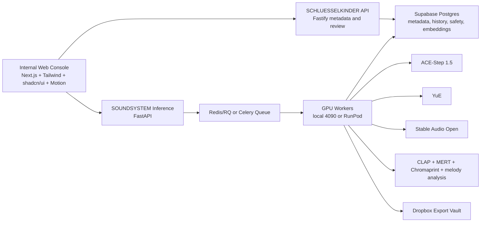

# System Architecture

## Architecture Principle

Separate creative orchestration from GPU execution.

The web/admin layer should feel like a dark soundsystem console. The inference service should feel boring, measurable, and replaceable.

## High-Level Shape



## Services

| Service | Runtime | Responsibility |
| --- | --- | --- |
| `apps/web` | Next.js | Internal UI, waveform workspace, prompt builder, character system, status console |
| `services/api` | Fastify/TypeScript | Existing archive/governance service, review state, brand rules |
| `services/soundsystem-inference` | FastAPI/Python | Generation job API, model adapters, GPU queue, stem packaging, audio safety checks |
| `workers/gpu` future module | Python | Long-running GPU execution and model cache management |
| `packages/soundsystem` future module | TypeScript | Shared prompt/module types for web and API once UI work starts |

## Module Boundaries

### Orchestration

- Generates job records.
- Resolves prompt modules and character settings.
- Applies policy gates before queueing.
- Does not call PyTorch directly.

### Inference

- Loads model adapters.
- Runs generations.
- Normalizes audio.
- Separates stems when the engine does not provide stems directly.
- Writes artifacts.
- Emits progress events and final manifests.

### Safety

- Runs before generation for prompt/reference checks.
- Runs after generation for audio similarity and metadata checks.
- Blocks Dropbox export when result is above risk thresholds.

### Storage

- Supabase/Postgres is canonical for metadata.
- Local disk or mounted volume is scratch.
- Dropbox is the collaboration/export vault.
- RunPod volumes are temporary compute storage only.

## Internal Folder Structure

```text
docs/soundsystem/
  README.md
  research.md
  architecture.md
  api-architecture.md
  database-schema.md
  generation-pipeline.md
  prompt-engine.md
  copyright-safety.md
  ui-wireframes.md
  roadmap-deployment.md
  execution-order.md

services/soundsystem-inference/
  app/
    main.py
    schemas.py
    prompt_engine.py
    job_store.py
    providers/
      base.py
      mock.py
  db/
    001_initial_schema.sql
  Dockerfile
  pyproject.toml
  README.md
```

Future folders after the MVP proves the shape:

```text
apps/web/app/admin/soundsystem/
packages/soundsystem/
services/soundsystem-inference/app/analysis/
services/soundsystem-inference/app/audio/
services/soundsystem-inference/app/providers/ace_step.py
services/soundsystem-inference/app/providers/yue.py
services/soundsystem-inference/app/providers/stable_audio.py
services/soundsystem-inference/app/storage/dropbox.py
services/soundsystem-inference/app/workers/
```

## Engine Selection

| User action | Default engine | Secondary engine |
| --- | --- | --- |
| CREATE TRACK | ACE-Step | YuE for lyric/vocal full song |
| BUILD RIDDIM | ACE-Step | Stable Audio Open for layers |
| GENERATE HOOK | ACE-Step | YuE |
| CREATE VOCALS | YuE | ACE-Step cover/lego |
| STEM REMIX | ACE-Step cover/repaint/lego | Demucs/audio-separator |
| DUB FX LAB | Stable Audio Open | ACE-Step lego FX |
| CHARACTER VOICE | ACE-Step adapter | YuE fine-tune later |
| COVER GENERATION | ACE-Step cover | Manual review required |
| PROMPT LIBRARY | GPT/Claude prompt services | Local templates |
| STYLE DNA SYSTEM | ACE-Step LoRA/LoKr | Embedding profile + tags |

## Risk And Tradeoffs

- Fast iteration favors ACE-Step; long-form vocals favor YuE but cost more GPU time.
- Stem-first workflows may require separation even when generation returns only a full mix. This can introduce artifacts, so every stem package stores source mix and separation model.
- Supabase is preferred for metadata, but large audio stays out of Postgres.
- Dropbox is familiar for creators, but not canonical state.
- Safety scores reduce risk; they do not prove legal clearance.
