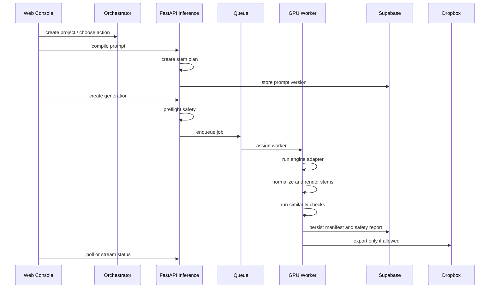

# Generation Pipeline

## Pipeline Overview

## Phases

### 1. Prompt Assembly

Inputs:

- Action: CREATE TRACK, BUILD RIDDIM, GENERATE HOOK, CREATE VOCALS, STEM REMIX, DUB FX LAB, CHARACTER VOICE, COVER GENERATION.
- Modules: energy, bass pressure, vocals, atmosphere, structure.
- Character: SHIBARI KAWAII or future internal characters.
- Technical targets: BPM, key, duration, stem requirements.

Outputs:

- `prompt_json`
- `stem_plan`
- engine-specific prompt text
- negative prompt
- safety hints
- seed policy

### 2. Preflight Safety

Block before queueing when:

- prompt references a living artist, specific commercial song, label, producer, or voice clone without clearance
- reference audio is not marked owned/licensed/public-domain
- LoRA/LoKr adapter provenance is missing
- requested output is marked release candidate without human review path

### 3. Engine Execution

ACE-Step:

- default for fast generation and editing
- use `text2music`, `cover`, `repaint`, `lego`, `complete`
- keep seeds, model, LM model, task type, duration, BPM, key, and adapter version

YuE:

- use for lyrics-to-song and vocal long-form
- use RunPod/A100 path for full song sessions when local 4090 is too slow or memory constrained

Stable Audio Open:

- use for FX, ambience, risers, industrial hits, texture beds
- never use as lead vocal engine

### 4. Stem Export

Every accepted generation package should include:

- full mix WAV
- stems WAV
- lyrics TXT/JSON
- prompt JSON
- metadata JSON
- cover image PNG/JPEG
- safety report JSON
- generation history JSON

If the generation engine does not emit stems:

1. render full mix
2. run source separation
3. tag stem confidence and separation model
4. keep original mix as canonical source

The target stem lanes are defined in [sound-model.md](./sound-model.md):
`kick`, `drums`, `percussion`, `bass`, `music`, `lead`, `vocals_main`,
`vocals_adlibs`, `fx`, `atmosphere`, `return_delay`, and `return_reverb`.

### 5. Analysis

Run:

- peak/loudness check
- duration and sample rate check
- Chromaprint/fpcalc fingerprint
- CLAP embedding
- MERT embedding where license allows
- melody contour/chroma similarity
- prompt-policy risk scan

### 6. Export

Dropbox export only happens when:

- preflight passed
- post-generation safety did not block
- all required artifacts exist
- prompt JSON and safety report are included
